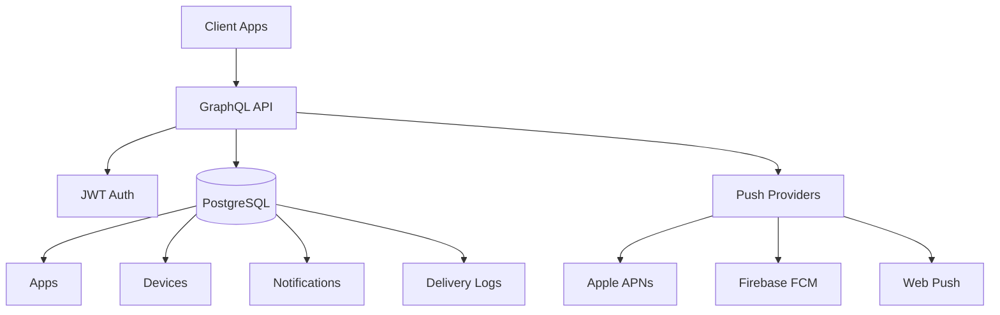

<h1 align="center">🚀 NitroPing</h1>

<p align="center">
  <strong>Self-hosted push notification service built with Vite, Vue 3 & Nitro</strong>
</p>

<p align="center">
  Take control of your push notifications with an open-source, developer-friendly platform
</p>

<p align="center">
  <a href="https://nitroping.dev"></a>
  <a href="https://hub.docker.com/r/productdevbook/nitroping"></a>
  <a href="https://npmjs.org/package/nitroping"></a>
  <a href="https://npmjs.org/package/nitroping"></a>
  <a href="https://github.com/productdevbook/nitroping/blob/main/LICENSE"></a>
  <a href="https://github.com/productdevbook/nitroping"></a>
  <a href="https://github.com/productdevbook/nitroping/discussions"></a>
</p>

<br>

## 📋 Table of Contents

- [✨ Features](#-features)
- [🚀 Quick Start](#-quick-start)
- [🏗️ Architecture](#️-architecture)
- [📱 SDKs](#-sdks)
- [🧪 Development](#-development)
- [🤝 Contributing](#-contributing)
- [🗺️ Roadmap](#️-roadmap)
- [📄 License](#-license)

## ✨ Features

<table>
<tr>
<td>

**🌍 Multi-Platform**
- iOS (APNs)
- Android (FCM)
- Web Push
- React Native (planned)
- Flutter (planned)

</td>
<td>

**🏗️ Modern Stack**
- Vite + Vue 3 & Nitro
- GraphQL API
- PostgreSQL
- TypeScript

</td>
<td>

**🔒 Self-Hosted**
- Full data control
- No vendor lock-in
- Custom deployment
- Privacy-focused

</td>
</tr>
<tr>
<td>

**📊 Analytics**
- Delivery tracking
- Performance metrics
- Real-time updates
- Custom dashboards

</td>
<td>

**🛡️ Secure**
- JWT authentication
- API key management
- Rate limiting
- Encrypted credentials

</td>
<td>

**🐳 DevOps Ready**
- Docker support
- Easy deployment
- Environment configs
- Health monitoring

</td>
</tr>
</table>

## 🎯 Why Choose NitroPing?

> **Take control of your push notifications with an open-source, developer-friendly platform**

- **🚀 Performance**: Built on Nitro for maximum efficiency
- **🔧 Developer Experience**: Clean APIs, extensive documentation, great DX
- **🌐 Flexibility**: Support for multiple notification providers
- **🔐 Privacy**: Self-hosted means your data stays yours
- **🆓 Open Source**: MIT licensed, community-driven development

## 🏗️ Architecture

NitroPing is built with a modern, scalable architecture:



### Core Components

- **GraphQL API**: Type-safe API built with [Nitro GraphQL](https://github.com/productdevbook/nitro-graphql)
- **Multi-tenant**: App-based isolation with encrypted credentials
- **Push Providers**: Native APNs, FCM, and Web Push support
- **Analytics**: Comprehensive delivery tracking and metrics
- **Security**: JWT authentication with per-app API keys

## 🚀 Quick Start

### Environment Setup

1. **Copy environment file**
   ```bash
   cp .env.example .env
   ```

2. **Generate required secrets**
   
   **JWT Secret** (for API authentication):
   ```bash
   # Option 1: Using Node.js
   node -e "console.log(require('crypto').randomBytes(64).toString('hex'))"
   
   # Option 2: Using OpenSSL
   openssl rand -hex 64
   
   # Option 3: Using online generator
   # Visit: https://generate-secret.vercel.app/64
   ```

   **Webhook Secret** (for delivery callbacks):
   ```bash
   # Option 1: Using Node.js
   node -e "console.log(require('crypto').randomBytes(32).toString('hex'))"
   
   # Option 2: Using OpenSSL
   openssl rand -hex 32
   ```

3. **Set up database**
   ```bash
   # Start PostgreSQL (using Docker)
   docker run --name nitroping-db -e POSTGRES_PASSWORD=postgres -e POSTGRES_DB=nitroping -p 5432:5432 -d postgres:17
   
   # Generate and run migrations
   pnpm db:generate
   pnpm db:migrate
   ```

4. **Start development server**
   ```bash
   pnpm dev --host  # Allows access from mobile devices on same network
   ```
   
#### Docker
If you prefer Docker, you can run NitroPing in a containerized environment. Make sure to set up the `.env` file with the necessary secrets and database connection details.

If running Docker compose for the first time, migration is needed. Run the docker compose with `migrate` profile to set up the database schema. 

```bash
docker compose up --profile migrate --profile dev -d 
```
For subsequent runs, you can use the `dev` profile to start the application without migrating again.

```bash
docker compose up --profile dev -d
```
For production deployments, you can use the `prod` profile to run the application in production mode.

```bash
docker compose up --profile prod -d
```

### 🐳 Docker Hub Image

Pull the latest image from Docker Hub:

```bash
# Pull latest version
docker pull productdevbook/nitroping:latest

# Or specific version
docker pull productdevbook/nitroping:v0.0.1
```

**Using with docker-compose.yaml:**
```yaml
services:
  server:
    image: productdevbook/nitroping:latest
    environment:
      DATABASE_URL: postgres://user:password@db:5432/nitroping
    ports:
      - "3000:3000"
```


### Your First Notification

1. **Create an app via GraphQL**
   ```graphql
   mutation CreateApp {
     createApp(input: {
       name: "My App"
       slug: "my-app"
       description: "My awesome app"
     }) {
       id
       apiKey
     }
   }
   ```

2. **Configure push providers** through the dashboard at `http://localhost:3000`

3. **Register a device**
   ```graphql
   mutation RegisterDevice {
     registerDevice(input: {
       appId: "your-app-id"
       token: "device-token"
       platform: IOS
     }) {
       id
     }
   }
   ```

4. **Send your first notification**
   ```graphql
   mutation SendNotification {
     sendNotification(input: {
       appId: "your-app-id"
       title: "Hello World!"
       body: "Your first push notification"
       targetDevices: ["device-id"]
     }) {
       id
       status
     }
   }
   ```

## 📱 SDKs

<table>
<tr>
<td align="center">
<strong>🍎 iOS</strong><br>
<a href="./ios/package">Swift Package</a><br>
<sub>Native iOS integration</sub>
</td>
<td align="center">
<strong>🤖 Android</strong><br>
<a href="./android">Kotlin SDK</a><br>
<sub>Native Android support</sub>
</td>
<td align="center">
<strong>⚛️ React Native</strong><br>
<em>Coming Soon</em><br>
<sub>Cross-platform mobile</sub>
</td>
<td align="center">
<strong>🎯 Flutter</strong><br>
<em>Coming Soon</em><br>
<sub>Google's framework</sub>
</td>
</tr>
</table>

### iOS Quick Setup

```swift
import NitroPingClient

// Configure in AppDelegate
NitroPingClient.configure(
    appId: "your-app-id",
    apiKey: "your-api-key",
    baseURL: "https://your-nitroping-instance.com"
)

// Register for push notifications
NitroPingClient.shared.registerForPushNotifications()
```

## 🧪 Development

### Tech Stack

- **Frontend**: Vite + Vue 3
- **Backend**: Nitro
- **Database**: PostgreSQL with Drizzle ORM
- **API**: GraphQL via [Nitro GraphQL](https://github.com/productdevbook/nitro-graphql)
- **UI**: shadcn/vue + Tailwind CSS v4
- **Testing**: Vitest
- **Linting**: @antfu/eslint-config

### Commands

```bash
# Development
pnpm dev --host    # Start dev server (accessible from mobile devices)
pnpm typecheck     # Type checking
pnpm lint          # Run linter

# Database
pnpm db:generate   # Generate migrations
pnpm db:migrate    # Run migrations
pnpm db:studio     # Open Drizzle Studio

# Build
pnpm build         # Build for production
```

## 🤝 Contributing

We welcome all contributions! Whether you're fixing bugs, adding features, or improving documentation.

<table>
<tr>
<td>

**🐛 Found a Bug?**
- [Open an issue](https://github.com/productdevbook/nitroping/issues)
- Provide reproduction steps
- Include system information

</td>
<td>

**💡 Have an idea?**
- [Start a discussion](https://github.com/productdevbook/nitroping/discussions)
- Propose new features
- Share architectural thoughts

</td>
<td>

**🧑‍💻 Want to code?**
- Fork the repository
- Create a feature branch
- Submit a pull request

</td>
</tr>
</table>

### Development Setup

```bash
# Clone and setup
git clone https://github.com/productdevbook/nitroping.git
cd nitroping/app
pnpm install

# Setup environment
cp .env.example .env
# Edit .env with your configuration

# Setup database
docker run -d --name nitroping-db \
  -e POSTGRES_PASSWORD=postgres \
  -e POSTGRES_DB=nitroping \
  -p 5432:5432 postgres:17

pnpm db:generate && pnpm db:migrate

# Start development
pnpm dev --host
```

## 🗺️ Roadmap

<details>
<summary><strong>✅ Completed Features</strong></summary>

- Core service architecture with Vite + Vue 3 & Nitro
- Multi-platform push providers (APNs, FCM, Web Push)
- GraphQL API with type safety
- Dashboard UI with analytics
- Device management and targeting
- Delivery tracking and metrics
- Encrypted credential storage
- JWT-based authentication
- Docker deployment & Docker Hub publishing

</details>

<details>
<summary><strong>🚧 In Progress</strong></summary>

- [Swift iOS SDK](https://github.com/productdevbook/nitroping/issues/14) - Native iOS integration
- [Queue System](https://github.com/productdevbook/nitroping/issues/13) - Background job processing
- Advanced scheduling features

</details>

<details>
<summary><strong>📋 Planned</strong></summary>

**SDKs & Integrations**
- [Android SDK](https://github.com/productdevbook/nitroping/issues/15) - Kotlin/Java support
- [React Native SDK](https://github.com/productdevbook/nitroping/issues/10) - Cross-platform mobile
- [Flutter SDK](https://github.com/productdevbook/nitroping/issues/11) - Google's framework
- [Unity SDK](https://github.com/productdevbook/nitroping/issues/12) - Game development

**Platform Features**
- [Authentication System](https://github.com/productdevbook/nitroping/issues/9) - User management
- Advanced analytics and reporting
- Template system for notifications
- A/B testing capabilities
- Webhook integrations

</details>

## 📄 License

MIT Licensed - see the [LICENSE](LICENSE) file for details.

---

<p align="center">
  <strong>Built with ❤️ by the open source community</strong>
</p>

<p align="center">
  <a href="https://nitroping.dev">🌐 Visit Website</a> •
  <a href="https://github.com/productdevbook/nitroping/stargazers">⭐ Star us on GitHub</a> •
  <a href="https://github.com/productdevbook/nitroping/discussions">💬 Join the discussion</a>
</p>

<p align="center">
  <em>Take control of your push notifications today!</em>
</p>